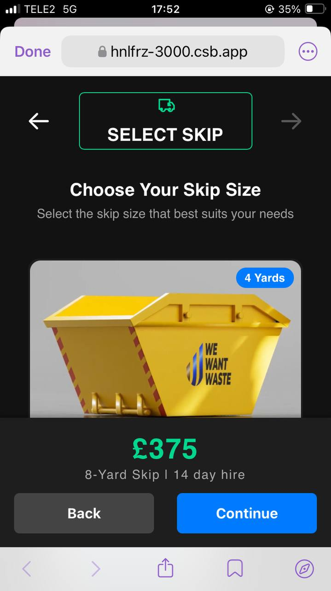
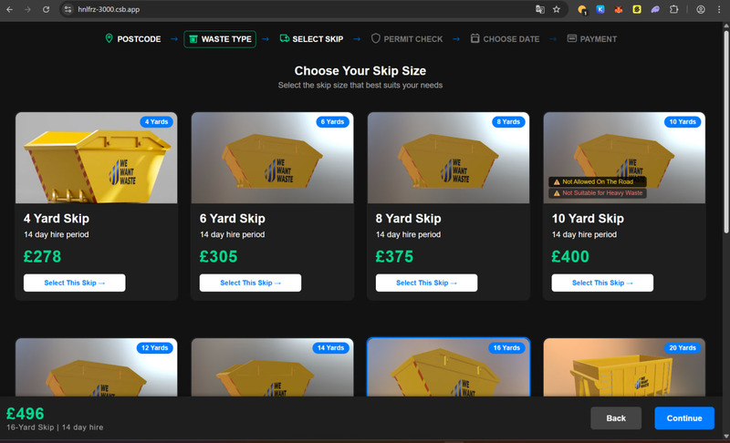

## 🧩 Skip Selector Redesign

This project introduces a UI/UX redesign focused on clarity, interaction, and responsiveness.

#### Mobile view:

#### Desktop view:

### 🖌️ Design Changes Overview

1. **Three-color element scheme**  
   The interface now consistently uses **white, green, and blue**.  
   - Green was added to create a more lively and dynamic feel.  
   - It highlights the price clearly and helps associate the choice with a positive action (such as making a purchase).

2. **Directional arrows**  
   Arrows are present throughout the UI to create a sense of direction and movement.  
   - The `Continue` button now has a simpler, more expected visual appearance without an arrow.  
   - Arrows remain in other parts of the interface to support visual feedback.

3. **4-card layout for desktop**  
   On larger screens, the skip selector displays **4 cards per row**, helping users compare more options at once.

4. **Compact select button**  
   The "Select This Skip" button no longer spans the full width of the card.  
   - This change improves visual structure and brings a sense of spatial rhythm.

5. **Grouped footer information**  
   The footer content is now better organized, presenting price and skip details in a clear, digestible layout.

6. **Enhanced header and mobile behavior**  
   - The top section now has more visual prominence on both desktop and mobile.  
   - On mobile, header navigation is simplified: scrolling is disabled, and the active step remains fixed in view.
